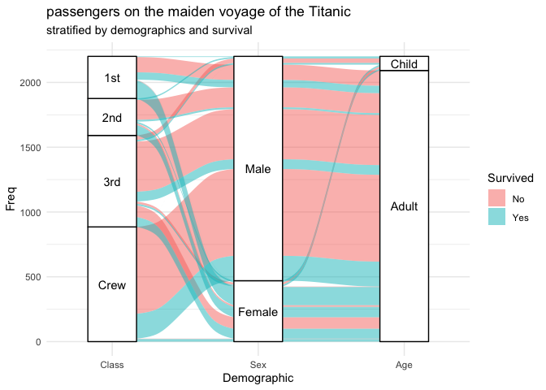

<!-- README.md is generated from README.rmd. Please edit that file -->
ggalluvial
==========

Design
------

This is a [**ggplot2** extension](http://www.ggplot2-exts.org/) for alluvial diagrams. The alluvial plots implemented here can be used to visualize frequency distributions over time or frequency tables involving several categorical variables. The design is derived mostly from the [**alluvial**](https://github.com/mbojan/alluvial) package, but the **ggplot2** framework induced several conspicuous differences:

-   **alluvial** understands a variety of inputs (vectors, lists, data frames), while **ggalluvial** requires a single data frame;
-   **alluvial** uses each variable of these inputs as a dimension of the data, whereas **ggalluvial** requires the user to specify the dimensions, either as separate aesthetics or as [key-value pairs](http://tidyr.tidyverse.org/);
-   **alluvial** produces both the *alluvia*, which link cohorts across multiple dimensions, and (what are here called) the *strata*, which partition the data along each dimension, in a single function; whereas **ggalluvial** relies on separate layers (stats and geoms) to produce strata, alluvia, and alluvial segments called *lodes* and *flows*.

Installation
------------

The latest stable release can be installed from CRAN:

``` r
install.packages("ggalluvial")
```

The [cran branch](https://github.com/corybrunson/ggalluvial/tree/cran) will contain the version most recently submitted to [CRAN](https://cran.r-project.org/package=ggalluvial).

Development versions can be installed from GitHub:

``` r
devtools::install_github("corybrunson/ggalluvial", build_vignettes = TRUE)
```

The [optimization branch](https://github.com/corybrunson/ggalluvial/tree/optimization) contains a development version with experimental functions to reduce the number or area of alluvial overlaps (see issue [\#6](/../../issues/6)). Install it as follows:

``` r
devtools::install_github("corybrunson/ggalluvial", ref = "optimization")
```

Usage
-----

### Example

Here is how to generate an alluvial diagram representation of the multi-dimensional categorical dataset of passengers on the Titanic:

``` r
titanic_wide <- data.frame(Titanic)
head(titanic_wide)
#>   Class    Sex   Age Survived Freq
#> 1   1st   Male Child       No    0
#> 2   2nd   Male Child       No    0
#> 3   3rd   Male Child       No   35
#> 4  Crew   Male Child       No    0
#> 5   1st Female Child       No    0
#> 6   2nd Female Child       No    0
ggplot(data = titanic_wide,
       aes(axis1 = Class, axis2 = Sex, axis3 = Age,
           weight = Freq)) +
  scale_x_continuous(breaks = 1:3, labels = c("Class", "Sex", "Age")) +
  geom_alluvium(aes(fill = Survived)) +
  geom_stratum() + geom_text(stat = "stratum", label.strata = TRUE) +
  theme_minimal() +
  ggtitle("passengers on the maiden voyage of the Titanic",
          "stratified by demographics and survival")
```



The data is in "wide" format, but **ggalluvial** also recognizes data in "long" format and can convert between the two:

``` r
titanic_long <- to_lodes(data.frame(Titanic),
                         key = "Demographic",
                         axes = 1:3)
head(titanic_long)
#>   Survived Freq alluvium Demographic stratum
#> 1       No    0        1       Class     1st
#> 2       No    0        2       Class     2nd
#> 3       No   35        3       Class     3rd
#> 4       No    0        4       Class    Crew
#> 5       No    0        5       Class     1st
#> 6       No    0        6       Class     2nd
ggplot(data = titanic_long,
       aes(x = Demographic, stratum = stratum, alluvium = alluvium,
           weight = Freq, label = stratum)) +
  geom_alluvium(aes(fill = Survived)) +
  geom_stratum() + geom_text(stat = "stratum") +
  theme_minimal() +
  ggtitle("passengers on the maiden voyage of the Titanic",
          "stratified by demographics and survival")
```


### Resources

For detailed discussion of the data formats recognized by **ggalluvial** and several examples that illustrate its flexibility and limitations, read the vignette:

``` r
vignette(topic = "ggalluvial", package = "ggalluvial")
```

The documentation contains several examples; use `help()` to call forth examples of any layer (`stat_*` or `geom_*`).

Feedback
--------

### Cite

If you use **ggalluvial**-generated figures in publication, i'd be grateful to hear about it! You can also cite the package according to `citation("ggalluvial")`.

### Contribute

Issues and pull requests are more than welcome! Pretty much every fix and feature of this package derives from a problem or question posed by someone with datasets or design goals i hadn't anticipated.
