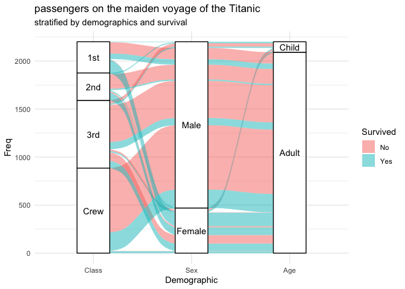

<!-- README.md is generated from README.rmd. Please edit that file -->

# ggalluvial

[](https://travis-ci.org/corybrunson/ggalluvial)
[](https://cran.r-project.org/package=ggalluvial)

[](https://doi.org/10.5281/zenodo.3836748)
[](https://doi.org/10.21105/joss.02017)

This is a [**ggplot2** extension](https://exts.ggplot2.tidyverse.org/)
for alluvial plots.

## Design

The alluvial plots implemented here can be used to visualize frequency
distributions over time or frequency tables involving several
categorical variables. The design is inspired by the
[**alluvial**](https://github.com/mbojan/alluvial) package, but the
**ggplot2** framework induced several conspicuous differences:

  - **alluvial** understands a variety of inputs (vectors, lists, data
    frames), whereas **ggalluvial** requires a single data frame;
  - **alluvial** uses each variable of these inputs as a dimension of
    the data, whereas **ggalluvial** requires the user to specify the
    dimensions, either as separate aesthetics or as [key-value
    pairs](https://tidyr.tidyverse.org/);
  - **alluvial** produces both the *alluvia*, which link cohorts across
    multiple dimensions, and (what are here called) the *strata*, which
    partition the data along each dimension, in a single function;
    whereas **ggalluvial** relies on separate layers (stats and geoms)
    to produce strata, alluvia, and alluvial segments called *lodes* and
    *flows*.

Additionally, **ggalluvial** arranges these layers vertically without
gaps, so that the secondary plotting axis indicates the cumulative
values of the strata at each dimension.

## Installation

The latest stable release can be installed from CRAN:

``` r
install.packages("ggalluvial")
```

The [`cran` branch](https://github.com/corybrunson/ggalluvial/tree/cran)
will contain the version most recently submitted to
[CRAN](https://cran.r-project.org/package=ggalluvial). It is duplicated
in the `master` branch, from which source the
[website](https://corybrunson.github.io/ggalluvial/) is built.

The development version can be installed from the (default) `main`
branch on
GitHub:

``` r
remotes::install_github("corybrunson/ggalluvial@main", build_vignettes = TRUE)
```

Note that, in order to build the vignettes, the imported packages
**alluvial**, **ggfittext**, and **ggrepel** must be installed. To skip
this step, leave `build_vignettes` unspecified or set it to `FALSE`.

The [`optimization`
branch](https://github.com/corybrunson/ggalluvial/tree/optimization)
contains a development version with experimental functions to reduce the
number or area of alluvial overlaps (see issue
[\#6](https://github.com/corybrunson/ggalluvial/issues/6)). Install it
as follows:

``` r
remotes::install_github("corybrunson/ggalluvial", ref = "optimization")
```

Note, however, that this branch has not kept pace with the `main` branch
or with recent upgrades on CRAN.

## Usage

### Example

Here is how to generate an alluvial plot representation of the
multi-dimensional categorical dataset of passengers on the Titanic:

``` r
titanic_wide <- data.frame(Titanic)
head(titanic_wide)
#>   Class    Sex   Age Survived Freq
#> 1   1st   Male Child       No    0
#> 2   2nd   Male Child       No    0
#> 3   3rd   Male Child       No   35
#> 4  Crew   Male Child       No    0
#> 5   1st Female Child       No    0
#> 6   2nd Female Child       No    0
ggplot(data = titanic_wide,
       aes(axis1 = Class, axis2 = Sex, axis3 = Age,
           y = Freq)) +
  scale_x_discrete(limits = c("Class", "Sex", "Age"), expand = c(.2, .05)) +
  xlab("Demographic") +
  geom_alluvium(aes(fill = Survived)) +
  geom_stratum() +
  geom_text(stat = "stratum", aes(label = after_stat(stratum))) +
  theme_minimal() +
  ggtitle("passengers on the maiden voyage of the Titanic",
          "stratified by demographics and survival")
```

<!-- -->

The data is in “wide” format, but **ggalluvial** also recognizes data in
“long” format and can convert between the two:

``` r
titanic_long <- to_lodes_form(data.frame(Titanic),
                              key = "Demographic",
                              axes = 1:3)
head(titanic_long)
#>   Survived Freq alluvium Demographic stratum
#> 1       No    0        1       Class     1st
#> 2       No    0        2       Class     2nd
#> 3       No   35        3       Class     3rd
#> 4       No    0        4       Class    Crew
#> 5       No    0        5       Class     1st
#> 6       No    0        6       Class     2nd
ggplot(data = titanic_long,
       aes(x = Demographic, stratum = stratum, alluvium = alluvium,
           y = Freq, label = stratum)) +
  geom_alluvium(aes(fill = Survived)) +
  geom_stratum() + geom_text(stat = "stratum") +
  theme_minimal() +
  ggtitle("passengers on the maiden voyage of the Titanic",
          "stratified by demographics and survival")
```

<!-- -->

### Documentation

For detailed discussion of the data formats recognized by **ggalluvial**
and several examples that illustrate its flexibility and limitations,
read the technical vignette:

``` r
vignette(topic = "ggalluvial", package = "ggalluvial")
```

The documentation contains several examples; use `help()` to call forth
examples of any layer (`stat_*` or `geom_*`) or of the conversion
functions (`to_*_form`).

## Acknowledgments

### Resources

Development of this package benefitted from the use of equipment and the
support of colleagues at [UConn Health](https://health.uconn.edu/).

### Contribute

Contributions in any form are more than welcome\! Pretty much every fix
and feature of this package derives from a problem or question posed by
someone with datasets or design goals i hadn’t anticipated. See the
[CONTRIBUTING](https://github.com/corybrunson/ggalluvial/blob/main/CONTRIBUTING.md)
file for guidance, and please respect the [Code of
Conduct](https://github.com/corybrunson/ggalluvial/blob/main/CODE_OF_CONDUCT.md).

### Cite

If you use **ggalluvial**-generated figures in publication, i’d be
grateful to hear about it\! You can also cite the package according to
`citation("ggalluvial")`.
